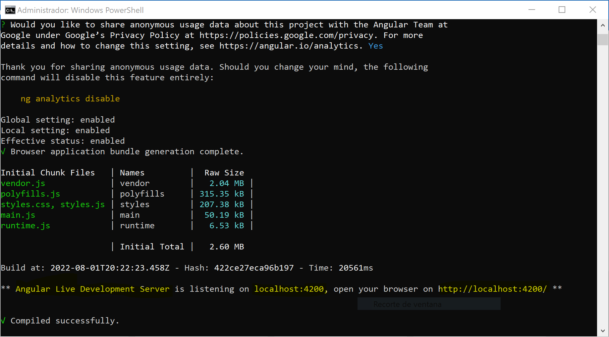
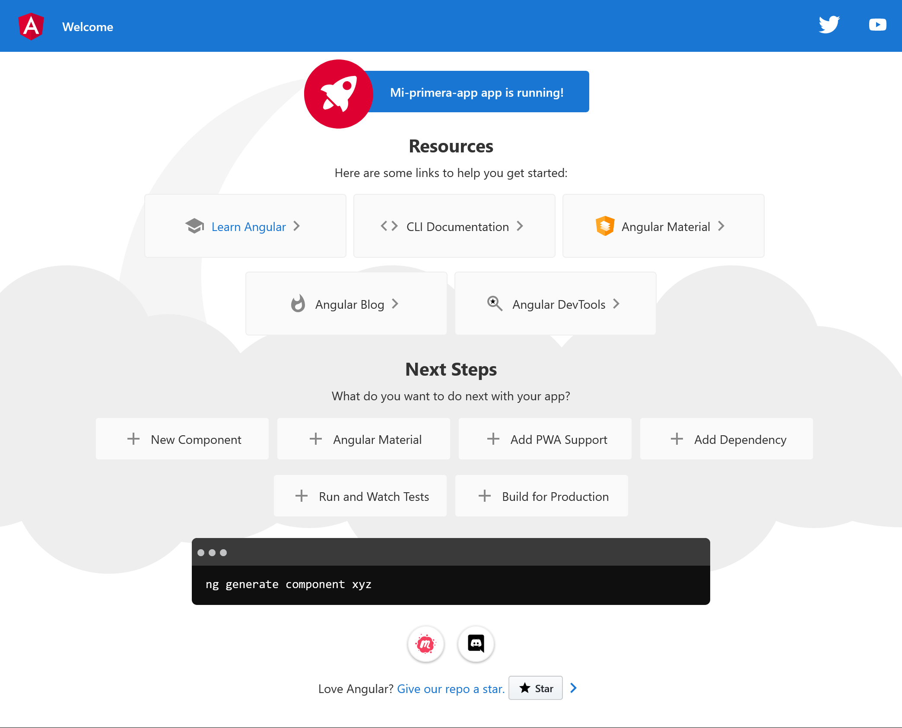

# Angular

## Creación de primer app mediante CLI
Creación de primera aplicación mediante CMD (se recomienda crear una carpeta lo más cercana al disco C o semejante evitando espacios o nombres largos en la carpeta)

Colocarse en la carpeta creada y ejecutar el siguiente comando:
`ng new Mi-primera-app`
`y para modo estricto`
`n para routing`
`CSS`

Esperar mientras temrina de crearse y ejecutamos el comando `ng serve -o` para verificar que todo sale bien, esto levantará el servidor y pondrá a nuestra disposición un servidor web.



Deberás ver la siguiente app:


## Iniciar y detener servidor Angular
Para detener sólo podemos poner `Control + C`
Si regresamos al navegador veremos que el servidor fue detenido con exito, para volver a levantar el sevidor sería el comando `ng serve -o`

## Modificando primera app
Todos los componentes se componen por referencias HTML, CSS y JS ó TS

Dentro de **src/index.html** encontramos la siguiente sección de código, la cual hace referencia a componentes que encuentra en la carpeta **app**

```
<body>
  <app-root></app-root>
</body>
```
Abriendo el archivo **app/app.component.html** veremos que es todo lo que se está desplegando en la página.

Ahora podemos ejecutar el servidor desde nuestro VisualStudio, para ello podemos ejecutar el mismo comando `ng serve -o`, si sale un error hay que abrir el `power shell` en modo administrador y ejecutar el siguiente comando: `Set-ExecutionPolicy Unrestricted`. Para verificar este valor empleamos el siguiente comando `Get-ExecutionPolicy`

Si llegaramos a modficar el archivo `src/app/app.component.html` no es necesario tener toda la estructura del HTML porque sólo es un componente, de hecho la información que encontramos en él sólo es incrustado en el archivo `src/index`

## Analisis del código de componentes
¿Como sabe el HTMLque debe abrir ese componente? Como vimos existe un archivo llamado `src/app/app.component.ts` donde vemos el identificador dentro de un atributo llamado **Selector** el cual indica la tag.

```
@Component({
  selector: 'app-root', //Nombre del componente
  templateUrl: './app.component.html', //Plantilla a utilizar
  styleUrls: ['./app.component.css'] //Estilos a aplicar
})
```

Para llamar el atributo de la clase: 

```
export class AppComponent { //Clase de Typescrpt
  title = 'Mi-primera-app'; //Actua como el atributo de la clase como variable
}
```

Se manda a llamar con la sintaxis: `{{title}}`

## Como recrear la carpeta de NodeModules

Para recuperar los módulos es tan sencillo como ejecutar el siguiente módulo dentro de la carpeta donde se ubica la app `npm install`

### Decoradores
Los decoradores se utilizan para colocar caracteristicas extra a la definición de la clase.

Dentro del decorador el elemento `bootstrap` indica la manera en la que levanta la aplicación